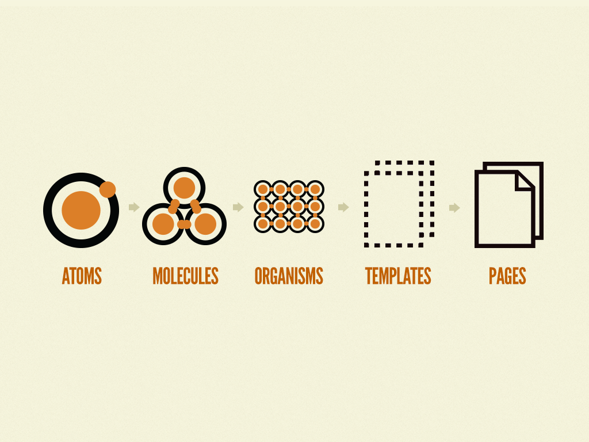

# Angular atomic design
This project is an angular template of atomic design
  

# Concept

  

## Description

 - Atoms: Dumb components (we cannot call any service or conditional (intelligent) expression it is only for displaying info that's all and doesn't have a unit test it has a storybook to display forms that can be taken with the props (inputs))
 - Molecules: intelligent components group of Atoms(you can call services and conditional expressions and it can have a unit test if it is intelligent or sotrybook if it has inputs and it is not intelligent)
 - Organisms: intelligent components group of Molecules(you can call services and conditional expressions and it can have a unit test if it is intelligent or sotrybook if it has inputs and it is not intelligent)
 - Templates: intelligent components group of Organisms and layout Designs(you can call services and conditional expressions and it can have a unit test if it is intelligent or sotrybook if it has inputs and it is not intelligent)
 - Pages: Generally used to group common components like header and footer with internal templates
 - Commun Folder: contains the common pages (as about us, terms and conditions) and common components headers, footers ....
 - Services Folder: contains API calls and common services and modules

  
## Example usefull CLI
```

ng generate module exampleForm --route exampleForm --module app.module

ng generate module example-form/pages/page1 --route page1 --module example-form.module

ng generate module example-form/Templates/example-temp --module example-form/pages/page1/page1.module
ng generate module example-form/Templates/example-temp2 --module example-form/pages/page1/page1.module
ng generate component example-form/Templates/example-temp
ng generate component example-form/Templates/example-temp2

ng generate module example-form/organisms/example-org --module example-form/pages/page1/page1.module
ng generate module example-form/organisms/example-org2 --module example-form/pages/page1/page1.module
ng generate module example-form/organisms/example-org3 --module example-form/pages/page1/page1.module
ng generate component example-form/organisms/example-org
ng generate component example-form/organisms/example-org2
ng generate component example-form/organisms/example-org3

ng generate module example-form/molecules/form --module example-form/organisms/example-org/example-org.module
ng generate module example-form/molecules/avatar-container --module example-form/organisms/example-org2/example-org2.module
ng generate module example-form/molecules/label-conatiner --module example-form/organisms/example-org/example-org.module
ng generate module example-form/molecules/list-conatiner --module example-form/organisms/example-org3/example-org3.module
ng generate component example-form/molecules/form
ng generate component example-form/molecules/avatar-container
ng generate component example-form/molecules/label-conatiner
ng generate component example-form/molecules/list-conatiner
  
ng generate module example-form/atoms/rich-text --module example-form/molecules/form/form.module
ng generate module example-form/atoms/avatar-comp --module example-form/molecules/avatar-container/avatar-container.module
ng generate module example-form/atoms/button --module example-form/molecules/form/form.module
ng generate module example-form/atoms/text --module example-form/molecules/form/form.module
ng generate module example-form/atoms/label --module example-form/molecules/label-conatiner/label-conatiner.module
ng generate module example-form/atoms/list --module example-form/molecules/list-conatiner/list-conatiner.module
ng generate component example-form/atoms/avatar-comp
ng generate component example-form/atoms/button
ng generate component example-form/atoms/button
ng generate component example-form/atoms/text
ng generate component example-form/atoms/label
ng generate component example-form/atoms/list

ng generate service services/nom-service

```
# Perspective
we want to add

-  [@ngrx/store](https://ngrx.io/guide/store) - RxJS powered state management for Angular apps, inspired by Redux

-  [@ngrx/effects](https://ngrx.io/guide/effects) - Side effect model for @ngrx/store

-  [@ngrx/router-store](https://ngrx.io/guide/router-store) - Bindings to connect the Angular Router to @ngrx/store

-  [@ngrx/entity](https://ngrx.io/guide/entity) - Entity State adapter for managing record collections.

-  [@ngrx/store-devtools](https://ngrx.io/guide/store-devtools) - Instrumentation for @ngrx/store enabling time-travel debugging

-  [@angular/router](https://angular.io/guide/router) - Angular Router

-  [@angular/material](https://github.com/angular/material2) - Angular Material

-  [jest](https://facebook.github.io/jest/) - JavaScript test runner with easy setup, isolated browser testing and snapshot testing

### DummyAPI to test

-  [https://any-api.com/](https://any-api.com/)

-  [https://reqres.in/](https://reqres.in/)

-  [https://www.programmableweb.com/category/books/api](https://www.programmableweb.com/category/books/api)


## Development server
Run `ng serve` for a dev server. Navigate to `http://localhost:4200/`. The app will automatically reload if you change any of the source files.


## Code scaffolding 
Run `ng generate component component-name` to generate a new component. You can also use `ng generate directive|pipe|service|class|guard|interface|enum|module`.
  

## Build 
Run `ng build` to build the project. The build artifacts will be stored in the `dist/` directory. Use the `--prod` flag for a production build. 


## Running unit tests
Run `ng test` to execute the unit tests via [Karma](https://karma-runner.github.io).


## Running end-to-end tests
Run `ng e2e` to execute the end-to-end tests via [Protractor](http://www.protractortest.org/).

  

## Further help
To get more help on the Angular CLI use `ng help` or go check out the [Angular CLI README](https://github.com/angular/angular-cli/blob/master/README.md).
